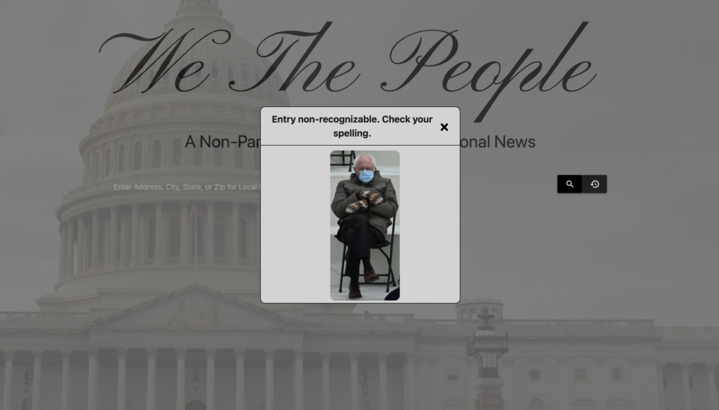

# we_the_people

# Description
We the People is an application that relays unbiased, non-partisan news about our user's government officials. Our users can search a state, county, city, or address to generate a list of officials relevant to that specific location. Upon the user clicking on the name of an official, the most recent news articles about that official from the Bing News API will be displayed. If no articles are found for the chosen official, the user will be notified with a popup modal saying, "no articles found for this representative." This application is user interactive, mobile responsive, and has a clean and scalable platform for our users to enjoy.

# Credits
* Raquel Lee https://github.com/RaquelLee

* Miguel Nolla Burgos https://github.com/mnollaburgos

* Michael Whitmer https://github.com/whitmerdroid

* Darius Hay https://github.com/DariusHay

# Technologies Used
* Google Civic API
* Bing News API

# Screenshots

# Link to Deployed Application
[We The People Official Website](https://raquellee.github.io/we_the_people/)
